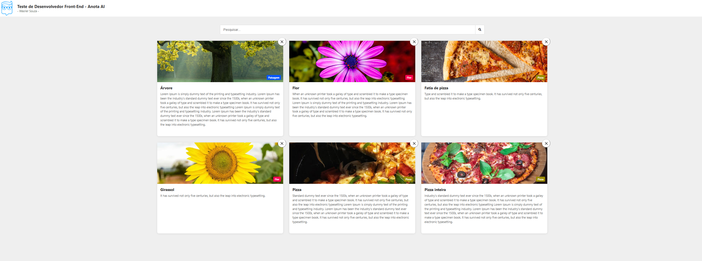

# 📋 AnotaAiTesteWasllerSouza

Bem-vindo ao **AnotaAiTesteWasllerSouza**, um projeto desenvolvido com **Angular** para gerenciar e exibir cartões com funcionalidades de busca e filtragem. Este README detalhado irá guiá-lo por todas as etapas para configurar, executar e entender o projeto.

## 🛠️ Tecnologias Utilizadas

- **Angular CLI**: 19.2.9
- **TypeScript**
- **RxJS**
- **SCSS** para estilização
- **Jest** para testes unitários
- **Node.js** e **npm** para gerenciamento de dependências

## 🚀 Funcionalidades

- Exibição de uma lista de cartões com título, descrição e imagem.
- Busca e filtragem de cartões em tempo real.
- Remoção de cartões da lista.
- Otimização de imagens utilizando a diretiva `NgOptimizedImage`.

## 📂 Estrutura do Projeto

Abaixo está uma visão geral da estrutura principal do projeto:

````plaintext
anota-ai-teste-wasller-souza/
├── src/
│   ├── app/
│   │   ├── shared/
│   │   │   ├── model/         # Modelos de dados (ex.: Card)
│   │   │   ├── services/      # Serviços para comunicação com APIs
│   │   │   ├── const/         # Constantes do projeto
│   │   ├── app.component.ts   # Componente principal
│   │   ├── app.module.ts      # Módulo principal
│   ├── assets/                # Recursos estáticos (imagens, ícones, etc.)
│   ├── styles.scss            # Estilos globais
├── README.md                  # Documentação do projeto
````

## 🖥️ Pré-requisitos

Antes de começar, certifique-se de ter as seguintes ferramentas instaladas:

- **Node.js** (versão 16 ou superior)
- **npm** (gerenciador de pacotes do Node.js)
- **Angular CLI** (instalado globalmente)

Para instalar o Angular CLI, execute:

```bash
npm install -g @angular/cli
```

---

## ⚙️ Configuração do Ambiente

1. **Clone o repositório**:
   ```bash
   git clone https://github.com/WasllerSouza/anota-ai-angular-teste.git
   cd anota-ai-angular-teste
   ```

2. **Instale as dependências**:
   ```bash
   npm install
   ```

3. **Inicie o servidor de desenvolvimento**:
   ```bash
   ng serve
   ```

4. **Acesse a aplicação**:
   Abra o navegador e vá para `http://localhost:4200/`.

---

## 🛠️ Como Utilizar

### 1. **Visualizar os Cartões**

- Ao abrir a aplicação, você verá uma lista de cartões com título, descrição e imagem.

### 2. **Buscar Cartões**

- Utilize o campo de busca no topo da página para filtrar os cartões por título ou descrição.
- A busca é feita em tempo real com debounce para melhorar a performance.

### 3. **Remover Cartões**

- Clique no botão de fechar (`X`) em um cartão para removê-lo da lista.

---

## 🖼️ Otimização de Imagens

Este projeto utiliza a diretiva `NgOptimizedImage` para melhorar o desempenho no carregamento de imagens. Certifique-se de que todas as imagens possuem os atributos `width` e `height` definidos para evitar problemas de layout.

---

## 🧪 Testes

### Executar Testes Unitários

Para rodar os testes unitários com o Karma, use:

```bash
ng test
```

### Executar Testes End-to-End

Para rodar testes e2e (caso configurados), use:

```bash
ng e2e
```

---

## 🏗️ Gerar Novos Componentes

Para criar novos componentes, serviços ou outros artefatos Angular, utilize os comandos do Angular CLI. Por exemplo:

```bash
ng generate component nome-do-componente
```

Para ver todos os esquemas disponíveis:

```bash
ng generate --help
```

---

## 📦 Build para Produção

Para gerar uma build otimizada para produção, execute:

```bash
ng build --prod
```

Os arquivos gerados estarão na pasta `dist/`.

---

## 📚 Recursos Adicionais

- [Documentação do Angular](https://angular.io/docs)
- [RxJS Documentation](https://rxjs.dev/guide/overview)
- [Guia de Estilo Angular](https://angular.io/guide/styleguide)

---

## 📝 Autor

Desenvolvido por **Wasller Souza**.

Se tiver dúvidas ou sugestões, sinta-se à vontade para abrir uma issue no repositório.

---

## 🎨 Prévia do Projeto



---

## 📄 Licença

Este projeto está licenciado sob a [MIT License](LICENSE).

```
